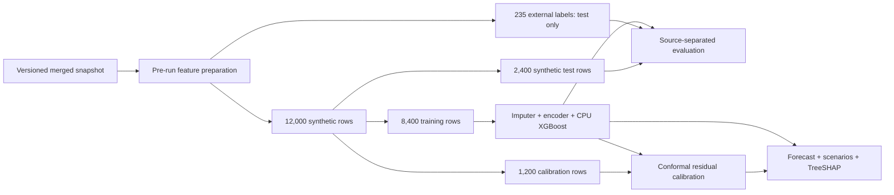

# AI Energy Forecaster

**A simulation-based AI training energy planner with an auditable leakage correction, source-separated evaluation, and explainable scenario comparisons.**

Plan a workload before it runs. Compare model size, token budget, hardware assumptions, and precision; inspect exact TreeSHAP drivers; export the assumptions alongside each estimate.

> **Evidence status:** this model learns its synthetic generator well, but fails external validation. It is a planning and ML-audit prototype, not a validated real-world energy estimator. 98.08% of usable labels are synthetic. No GPU, LLM API, or cloud training service is needed.

## Results worth inspecting

All models predict `log10(energy_kwh)`. Log-scale R² is **not percentage accuracy**.

| Model / evaluation | Rows | R², log₁₀ | RMSE, log₁₀ | MAE, kWh | R², kWh |
|---|---:|---:|---:|---:|---:|
| Archived leaky model / original blended holdout | 2,447 | 0.9947 | 0.0651 | 0.8504 | 0.7344 |
| Duration ablation / synthetic holdout | 2,400 | 0.9953 | 0.0595 | 0.1219 | 0.9509 |
| **Corrected / synthetic holdout** | **2,400** | **0.9940** | **0.0673** | **0.1305** | **0.9427** |
| **Corrected / all external labels** | **235** | **−2.3572** | **1.8843** | **44.8984** | **−0.0625** |
| Synthetic-training median / external labels | 235 | −1.4215 | 1.6003 | 45.1631 | −0.0688 |

The old UI claimed R² 0.9948. Replaying the archived artifact on its original split in the recorded environment yields 0.994714; that measured replay is retained rather than copying the display claim. The old blended holdout and new evaluation protocol are different. The controlled duration ablation uses the same 8,400 synthetic training rows, 2,400 test rows, and estimator settings as the corrected model, adding only log-duration as an input.

External performance is worse than the training-median baseline on log-energy. This is a generalization failure, not a production accuracy claim. Source-level corrected R²: Hugging Face **−3.8135** (168 rows); MLPerf **−0.5051** (66 rows). CodeCarbon has one row, so R² is undefined. Full precision metrics, baseline comparisons, interval coverage, and predictions are in [reports](reports/).

## Product walkthrough

- **Forecast:** pre-run inputs; model-derived kWh; user-supplied electricity and carbon assumptions; synthetic prediction interval; local TreeSHAP explanation; input-range warnings; JSON evidence report.
- **Scenario comparison:** rerun the model for fewer tokens, fewer GPUs, and alternative precisions. No hard-coded savings percentages. These are model comparisons, not causal recommendations; changes may affect quality, runtime, or memory requirements.
- **Budget Explorer:** hold tokens and hardware fixed, compare candidate model sizes, and screen by the point estimate or synthetic interval upper bound. It does not validate GPU memory fit or claim the largest model is actually trainable.
- **Evidence & Model Card:** source provenance, failed external validation, archived and corrected results, calibration coverage, SHAP plots, and downloadable model manifest.

## Dataset audit

| Source | Raw rows | Usable positive labels | Label provenance |
|---|---:|---:|---|
| Synthetic | 12,000 | 12,000 | Physics-inspired generator with heuristic runtime, random noise, and PUE |
| Hugging Face | 168 | 168 | Model metadata; energy estimated using parameter-based hours and assumed TDP |
| MLPerf | 91 | 66 | Minimum extracted latency × assumed accelerator TDP × accelerator count |
| CodeCarbon | 1 | 1 | Instrumented CPU RandomForest experiment on sklearn digits |
| **Total** | **12,260** | **12,235** | **25 MLPerf rows lack a usable energy target** |

Synthetic share is **97.88% of raw rows**, or **98.08% of usable labeled rows**. The proposed count of 259 external rows was inaccurate for this snapshot: there are 260 raw external rows and 235 evaluable ones. The missing CodeCarbon source tag came from assigning scalars to an empty dataframe; preparation recovers provenance from `original_file`, and the processor now initializes its index correctly.

“External” does not mean ground-truth GPU training energy. Hugging Face and MLPerf labels are estimates, and MLPerf rows lack model parameters, tokens, and FLOPs. HF has existing log-FLOPs estimates, which are preserved; its omitted token column remains missing rather than being reconstructed from a label. Numeric missing values use **synthetic-training-only medians**, and unknown categories are handled by the saved encoder. This keeps evaluation executable but does not make incomplete workloads comparable. [Missing-feature rates](reports/missing_feature_rates.csv) expose this limitation.

The existing snapshot is preserved. No new measurements or additional real-world validation are claimed. Upstream collectors are historical acquisition scripts, not a guaranteed current ingestion service; raw source version, URL, and licensing provenance need a fuller audit before expanding or redistributing new source data.

## What the leakage audit fixed

The old model used `log_duration`, while its energy target was largely calculated from duration × power. Duration is not known before the training run, so this made a pre-run prediction task partly arithmetic. The old feature list also included source and label-quality encodings unavailable as meaningful user inputs.

The corrected feature contract is:

```text
log_params, gpu_count, tdp_w, batch_size, log_flops, log_tokens,
precision, task, train_type
```

No duration, emissions, target, source, or label-quality predictor is permitted. Raw duration stays in the source snapshot for provenance and the explicit audit ablation only. GPU identity chooses the simulator's TDP assumption in the UI; GPU identity itself is not a model predictor. Profiles sharing a TDP are consequently indistinguishable to this model.

An sklearn `Pipeline` persists median imputation, one-hot encoding, and XGBoost together. It replaces independently encoded frontend values and guarantees that training and inference use the same column contract. FLOPs use `6 × parameters × tokens`, a simplifying assumption of this simulator rather than a universal workload model.

## Evaluation and uncertainty



Seed 42 fixes the splits. Calibration and external rows never fit preprocessing or the corrected estimator. The model uses 500 trees, depth 6, learning rate 0.05, subsample 0.8, column subsample 0.8, histogram trees, CPU, and two worker threads. No external-score hyperparameter search is performed.

The finite-sample split-conformal residual quantile is calculated on absolute log-energy errors. Intervals are exponentiated back to kWh and therefore multiplicative/asymmetric on the energy scale. Nominal coverage is 90%; observed coverage is **88.21% on synthetic test data and 2.13% externally**. The external interval is demonstrably unreliable. Exchangeability with calibration data is required for the usual coverage result; see [Angelopoulos & Bates](https://arxiv.org/abs/2107.07511).

The generator samples a limited set of workloads and imposes a runtime floor. Much of its behavior is deterministic, which explains the high corrected synthetic R². Batch size and task do not directly determine synthetic energy, and model explanations must not be interpreted as discovering real causal energy laws. Numeric warnings only check marginal training ranges; they do not establish that a joint configuration is well supported.

## Reproduce locally

Use Python **3.12–3.14** with the pinned dependencies; this snapshot was trained and tested with **3.14.3**. No GPU is required. Run commands from the repository root:

```powershell
python -m venv venv
.\venv\Scripts\python -m pip install -r requirements-dev.txt
.\venv\Scripts\python src/final_feature_engineering.py
.\venv\Scripts\python src/train_model.py
.\venv\Scripts\python src/shap_analysis.py
.\venv\Scripts\python -m unittest discover -s tests -v
.\venv\Scripts\python -m streamlit run app.py
```

On macOS/Linux, use `venv/bin/python` in place of `.\venv\Scripts\python`. The checked-in model supports running the app after installing only `requirements.txt`; SHAP and matplotlib are needed to regenerate global plots, not for live explanations. Live exact TreeSHAP contributions come from XGBoost's native `pred_contribs` output. Only load trusted joblib artifacts.

Optional local scenario export: `python -m src.save_recommendations`. Rebuilding the merged snapshot from the existing component files is `python src/merge_datasets.py`; record a new dataset hash and repeat the complete evaluation if any component changes.

## Lightweight model operations

| Artifact | Purpose |
|---|---|
| `models/legacy/` | Original model and encoded dataset for replaying its original holdout |
| `models/xgboost_energy_forecaster.pkl` | Corrected preprocessing + model bundle |
| `models/metadata.json` | Dataset/model SHA-256, package versions, feature schema, split counts, calibration radius, training ranges |
| `reports/split_manifest.csv` | Stable source-snapshot row IDs and split membership |
| `reports/model_comparison.csv` | Archived, ablation, corrected, and median-baseline results |
| `reports/predictions.csv` | Row-level held-out targets and estimates |
| `reports/shap_*` and `models/shap_*.png` | Exact TreeSHAP sample IDs, importance table, and corrected plots |
| `tests/` | Leakage, split isolation, imputation, SHAP additivity, scenario consistency, and app interaction checks |

This project emphasizes energy planning and model validity. It deliberately avoids repeating a predictive-maintenance project's agent, MLflow/DVC stack, or deployment infrastructure. The narrow operations layer is a versioned evidence trail. Plain-language explanations are deterministic and grounded in actual SHAP values; no GenAI API is required.

## Deployment

Keep the existing Streamlit Community Cloud deployment connected to this repository's `main` branch and `app.py`. The app reads the versioned model; it does not retrain on startup. Community Cloud redeploys when code or dependencies are pushed, as described in the [Streamlit management documentation](https://docs.streamlit.io/deploy/streamlit-community-cloud/manage-your-app). Its Python runtime must support the pinned packages (Python 3.12 or newer); local validation used 3.14.3. No secrets are required.

## Resume and interview use

See [RESUME.md](RESUME.md) for defensible bullets and a short walkthrough. Lead with leakage auditing, distribution-shift evaluation, explainable planning, and reproducibility. Do not describe 0.9940 R² as real-world accuracy or claim measured energy savings.
